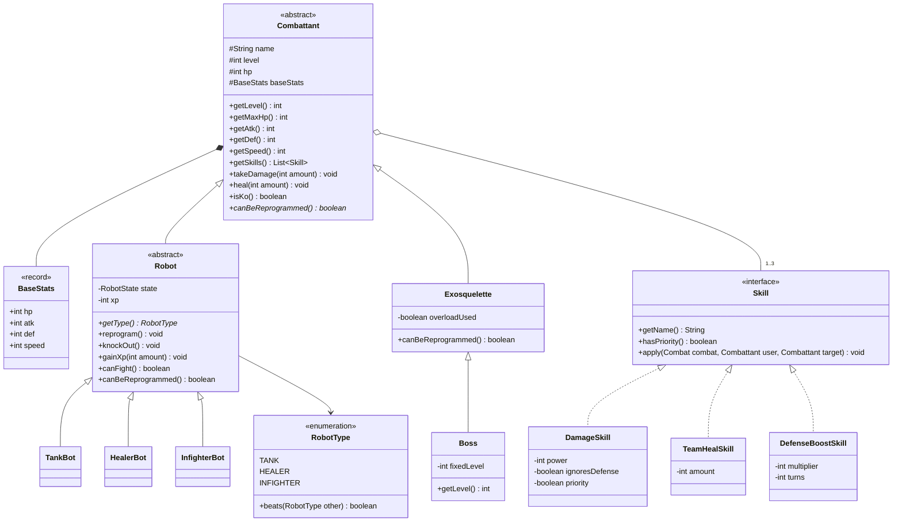
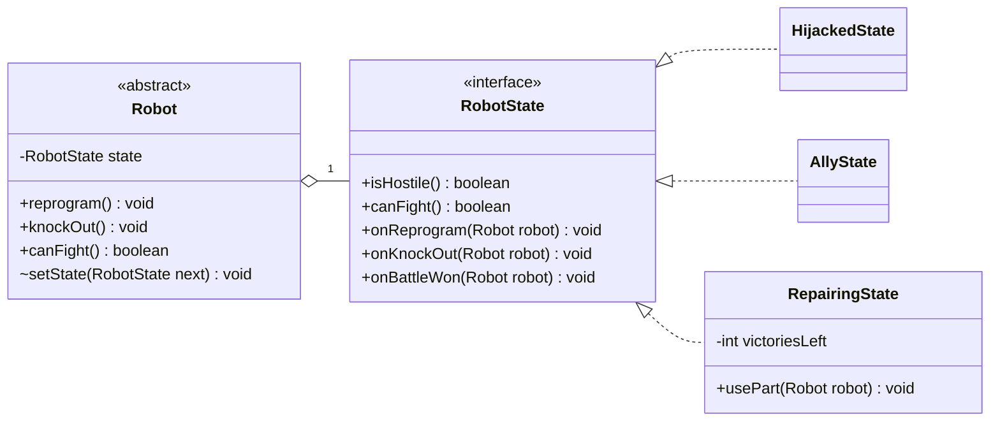
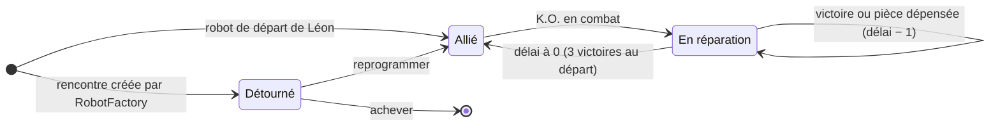
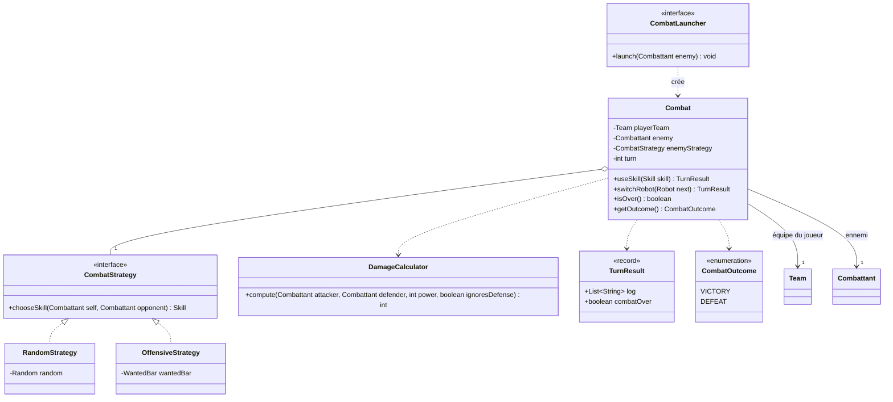
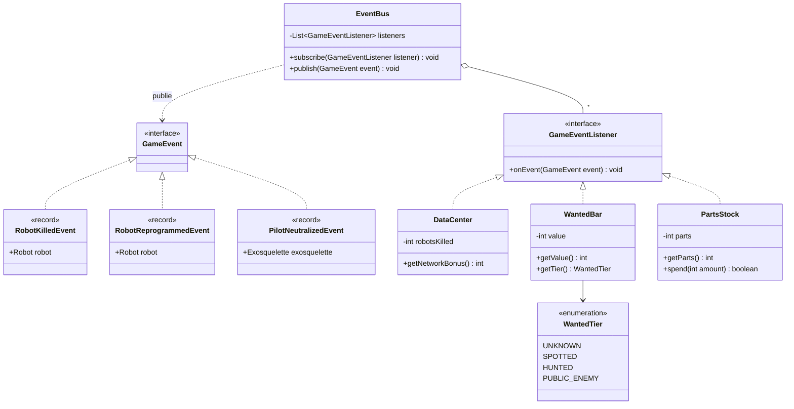
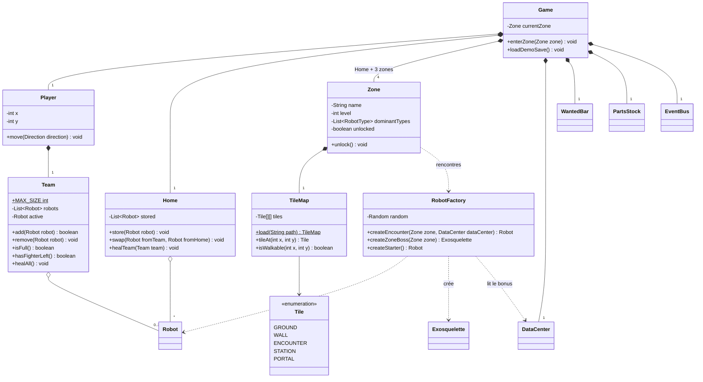
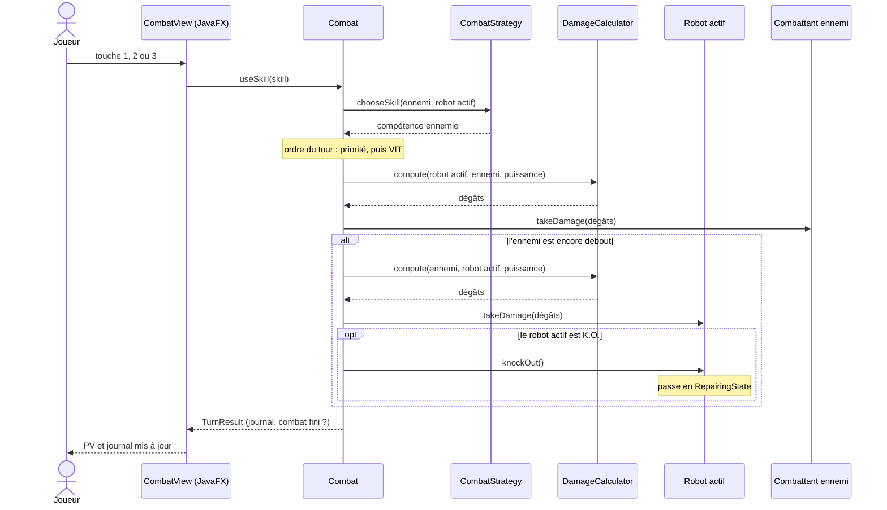
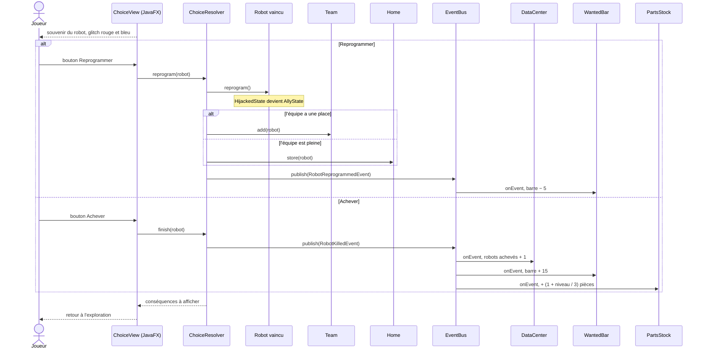
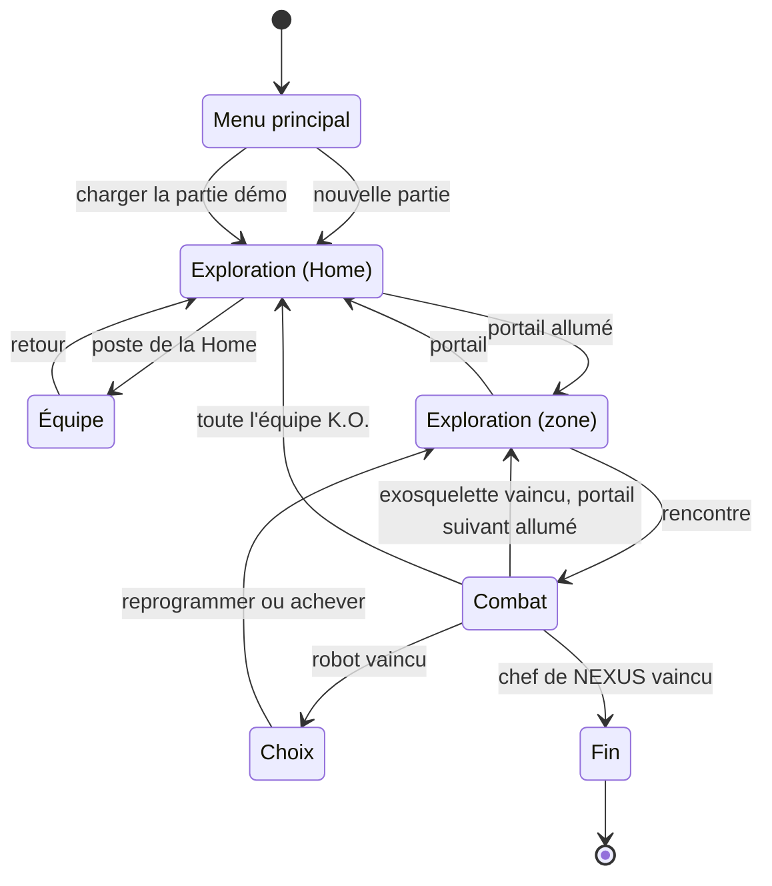

# Diagrammes UML de Reboot

Première version, tirée de la section « Architecture visée » du [GDD](gdd.md). Rien n'est encore codé : ces diagrammes décrivent le modèle à construire, pas un existant. Les noms de classes repris du GDD sont gardés tels quels ; ceux ajoutés ici sont des propositions, listées dans [Points à trancher](#points-à-trancher).

Les diagrammes sont écrits en Mermaid : GitHub les affiche directement, et ils se modifient comme du texte.

| # | Diagramme | Ce qu'il montre | Design pattern |
| --- | --- | --- | --- |
| 1 | [Combattants et compétences](#1-combattants-et-compétences) | Héritage des robots, compétences | Héritage, polymorphisme |
| 2 | [États d'un robot](#2-états-dun-robot) | Détourné, Allié, En réparation | State |
| 3 | [Combat](#3-combat) | Tour par tour, IA ennemie, dégâts | Strategy |
| 4 | [Conséquences du choix](#4-conséquences-du-choix) | Réseau, barre de recherche, pièces | Observer |
| 5 | [Joueur et monde](#5-joueur-et-monde) | Équipe, Home, zones, rencontres | Composition, Factory |
| 6 | [Séquence : un tour de combat](#6-séquence--un-tour-de-combat) | Qui appelle qui pendant un tour | Aucun |
| 7 | [Séquence : reprogrammer ou achever](#7-séquence--reprogrammer-ou-achever) | La scène phare du POC | State + Observer |
| 8 | [Enchaînement des écrans](#8-enchaînement-des-écrans) | La boucle de jeu | Aucun |

## 1. Combattants et compétences

`Combattant` porte ce qui est commun à tout ce qui se bat : stats, PV, compétences. Les stats se calculent à partir des stats de base et du niveau (+ 10 % de la base par niveau).

Deux branches en héritent. Les `Robot` ont un état et peuvent être reprogrammés. Les `Exosquelette` sont pilotés par des humains : `canBeReprogrammed()` renvoie `false`. Le chef de NEXUS est un `Boss`, un exosquelette particulier qui redéfinit `getLevel()` pour renvoyer son niveau fixe : c'est l'exemple de polymorphisme du GDD.

Chaque compétence est un objet `Skill` : en ajouter une ne demande de toucher à aucune classe de robot.

Correspondance avec les compétences du GDD :

| Compétence | Classe | Réglage |
| --- | --- | --- |
| Frappe, Écrasement, Rafale de coups | `DamageSkill` | puissance 10, 16, 16 |
| Nanobots corrosifs | `DamageSkill` | puissance 12, `ignoresDefense` |
| Crochet | `DamageSkill` | puissance 12, `priority` |
| Surcharge (exosquelettes) | `DamageSkill` | puissance 18, une fois par combat via `overloadUsed` |
| Patch réseau | `TeamHealSkill` | 15 PV à toute l'équipe active |
| Blindage | `DefenseBoostSkill` | DEF × 2 pendant 2 tours |

## 2. États d'un robot

Un ennemi et un allié sont la même classe `Robot` : seul son état change. `Robot` délègue à son `RobotState` tout ce qui dépend de l'état, au lieu d'empiler des `if`.

Les transitions entre états :

## 3. Combat

`Combat` ne connaît ni JavaFX ni la carte : il se teste seul. L'IA ennemie est une `CombatStrategy` interchangeable ; `RandomStrategy` reçoit son générateur aléatoire par le constructeur, ce qui rend les tests reproductibles. `CombatLauncher` est la frontière entre l'exploration et le combat.

`DamageCalculator` applique la formule du GDD : `max(1, puissance + ATK − DEF)`, puis × 1,5 arrondi à l'entier inférieur si le type de l'attaquant bat celui du défenseur. `OffensiveStrategy` est un bonus (COULD).

## 4. Conséquences du choix

Reprogrammer, achever ou neutraliser un pilote publie un événement : la barre de recherche bouge dans les trois cas, donc il y a trois événements. Ceux qui en dépendent s'abonnent : le code du combat et de l'écran de choix ne connaît ni le réseau, ni la barre de recherche, ni le stock de pièces.

| Événement | `DataCenter` | `WantedBar` | `PartsStock` |
| --- | --- | --- | --- |
| `RobotKilledEvent` | robots achevés + 1 | + 15 | + (1 + niveau / 3) pièces |
| `RobotReprogrammedEvent` | Aucun effet | − 5 | Aucun effet |
| `PilotNeutralizedEvent` | Aucun effet | + 10 | Aucun effet |

Le bonus du réseau vaut `min(5, robotsAchevés / 3)`, et la barre reste entre 0 et 100.

## 5. Joueur et monde

`Player` possède sa `Team` (3 robots au plus) ; la `Home` stocke les autres et répare les K.O. `RobotFactory` crée les rencontres d'une zone, au niveau `zone + bonus du réseau`.

## 6. Séquence : un tour de combat

Le joueur choisit une compétence. Le plus rapide joue en premier, sauf si une compétence est prioritaire (Crochet).

## 7. Séquence : reprogrammer ou achever

La scène phare : après une victoire contre un robot, le joueur choisit. Les deux branches montrent le State (le robot change d'état) et l'Observer (les conséquences se propagent seules).

## 8. Enchaînement des écrans

La boucle de jeu du GDD, vue comme une suite d'écrans.

## Points à trancher

Ces choix ne sont pas dans le GDD. Ils sont à valider avant de coder.

1. **Classes ajoutées** : `BaseStats`, `RobotType`, les trois implémentations de `Skill`, `DamageCalculator`, `TurnResult`, `CombatOutcome`, `EventBus`, `PartsStock`, `WantedTier`, `ChoiceResolver`, `Game`, `Zone`, `TileMap`, `Tile`. Leurs noms sont libres.
2. **Surcharge une fois par combat** : gérée ici par un booléen dans `Exosquelette`. Une `Skill` à usage limité serait plus générale.
3. **Plus aucun robot disponible** (tous en réparation) : toujours ouvert dans le GDD, donc absent des diagrammes.
4. **XP et niveaux** (SHOULD) : seul `gainXp()` apparaît ; le détail du passage de niveau n'est pas modélisé.

## Déjà tranché

- **`Boss` hérite d'`Exosquelette`**, et non de `Robot` : le chef de NEXUS est un humain en exosquelette, jamais reprogrammable et sans état « Détourné ».
- **Trois événements** : `RobotKilledEvent`, `RobotReprogrammedEvent` et `PilotNeutralizedEvent`, parce que la barre de recherche bouge aussi quand on reprogramme (− 5) ou qu'on neutralise un pilote (+ 10).
